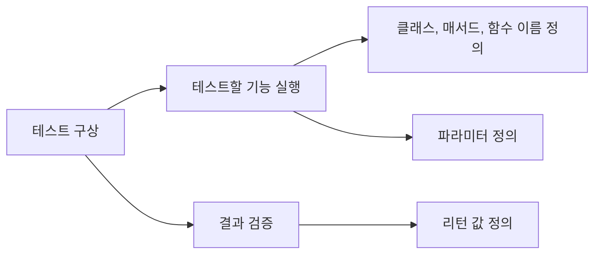

# TDD(Test-Driven Development) Study
## Environment
* Java 11
* Junit 5
* IntelliJ IDEA

## Study book
* 테스트 주도 개발 시작하기 (최범균 저, 가메출판사)

## Chapter 01. TDD 개발 준비
* Gradle + JUnit 5 프로젝트 생성 및 설정

## Chapter 02. TDD 시작
### 기존 개발 방식
* 개발/테스트 흐름


* 테스트할 코드가 너무 많아짐

### TDD란
* 기능을 검증하는 테스트 코드를 먼저 작성하고 테스트를 통과시키기 위해 개발을 진행
* 테스트 코드를 작성하면서 구현체의 클래스, 메소드 이름, 파라미터, 리턴 타입 등을고민 -> 실제 코드 설계하는 과정과 유사
* 컴파일 오류가 나더라도 테스트 코드를 먼저 작성하고 구현체를 최소로 구현 -> 다시 테스트 코드 작성 -> 구현을 반복 => 점진적으로 기능 완성
* 실체 구현체는 src/test에서 작성 후, 테스트가 완료되면 src/main으로 이동
* 테스트 코드도 유지보수 대상이므로 의미가 잘 드러나고 중복된 코드가 없도록 리팩토링 필요

### TDD 흐름


* 테스트를 먼저 작성 -> 테스트를 통과시킬만큼 코드를 작성 -> 리팩토링의 과정을 반복
* **레드-그린-리팩터**라고도 불림
  * 테스트 코드로 실패 케이스를 작성(레드)
  * 코딩으로 정상적으로 통과하도록 기능 구현(그린)
  * 리팩토링(리팩터)

#### 테스트가 개발을 주도
* 테스트 코드를 만들면, 다음 개발 범위가 정해짐
* 테스트 코드가 추가되면서 검증하는 범위가 넓어질수록 구현도 점점 완성

#### 지속적인 코드 정리
* 테스트 코드가 있으면 리팩토링 후에 기능이 정상 동작하는 것을 바로 확인 가능하므로, 과감하게 리팩토링 가능

#### 빠른 피드백
* 새로운 기능 추가나 기존 코드 수정 시, 바로 동작을 확인할 수 있어 빠른 피드백 가능

## Chapter 03. 테스트 코드 작성 순서
### 기본적인 테스트 코드작성 순서
* 쉬운 경우에서 어려운 경우로 진행
* 예외적인 경우에서 정상적인 경우로 진행
* 지속적인 리팩토링
  * 코드가 길어지면, 메소드 추출과 같은 기법을 사용해서 매서드 이름으로 코드의 의미를 표현 가능
  * 마틴 파울러가 쓴 '[리팩토링](http://www.kyobobook.co.kr/product/detailViewKor.laf?ejkGb=KOR&mallGb=KOR&barcode=9791162242742&orderClick=LAG&Kc=)' 도서 권장

**Q.** 복잡한 테스트부터 시작하면 안되는 이유<br/>
* A. 처음부터 복잡한 상황을 테스트로 추가하면 해당 테스트를 위해 한 번에 구현해야할 코드가 많아짐

**Q.** 예외 상황을 먼저 테스트 하는 이유 
* A. 다양한 예외 상황은 복잡한 if-else 블록을 동반. 정상 케이스 작성 후, 예외 상황을 작성하다보면 실체 구현체의 구조가 크게 바뀔 수 있음
* A. 예외 상황에 대한 구현체를 먼저 작성하면 구조가 크게 바뀌는 일을 줄일 수 있음


> 테스트 케이스의 메소드명은 한글로 작성 가능
>  * 영어로 표현하기에 메소드명이 너무 길어질 경우, 한글로 표현하는 것도 한 가지 방법

### 테스트할 목록 정리
* TDD를 시작할 때 테스트할 목록을 미리 정리
* 정리 후, 어떤 테스트가 구현이 쉬울지, 예외적인지 판단하고 순서대로 진행
* 테스트 진행 중 새로운 테스트 케이스가 필요하거나 떠오르면 목록에 반드시 추가하고 테스트 진행
* 범위가 큰 리팩토링은 시간이 오래 걸려 TDD 흐름을 깨기 쉬움. 규모가 큰 리팩토링은 목록에 추가하고, 테스트 작성에 집중
  * 범위가 큰 리팩토링 진행 전에는 반드시 코드 Commit 필요
  
## Chapter 04. TDD/기능 명세/설계
### 기능 명세
* 설계는 기능 명세로부터 시작
* 스토리보드를 포함한 다양한 형태의 요구사항 문서를 이용해서 기능 며세를 구체화
* 기능 명세를 구체화하는 과정에서 입력과 결과를 도출하고 이를 코드 메소드 이름, 파라미터, 리턴 타입에 반영
* TDD 자체가 설계는 아니지만, **테스트 코드를 작성하는 과정에서 일부 설계를 진행**



#### 필요한 만큼만 설계
* TDD에서 테스트를 통과할 만큼만 코드 작성하고 검증 후, 보강하는 것처럼 설계도 최소한부터 시작
* 필요한 것을 예측해서 미리 설계하는 것이 꼭 유연한 구현을 의미하지 않음

### 기능 명세 구체화
* 필요한 기능에 대한 상세한 예시를 기준으로 입력, 결과값을 도출
* 구체적인 테스트 케이스 마련

## Chapter 05. JUnit 5 기초
### JUnit 5 모듈 구성
#### JUnit 플랫폼
* 테스팅 프레임워크를 구동하기 위한 런처와 테스트 엔진을 위한 API 제공
* maven-surefire-plugin 2.22.0 버전부터 JUnit 5 플랫폼을 지원
* Gradle 4.6부터 JUnit 5 플랫폼 지원
* 그 이하 버전은 별도로 JUnit 5 플랫폼 사용을 명시해야 함
  * maven
  ```xml
  <dependencies>
    <dependency>
      <groudId>org.junit.jupiter</groupId>
      <artifactId>junit-jupiter</artifactId>
      <version>5.5.0</version>
      <scope>test</scope>
    <dependency>
  </dependencies>
  
  ...
  <build>
    <plugins>
      <!-- JUnit 5 플랫폼 사용 명시 -->
      <plugin>
        <artifactId>maven-surefire-plugin</artifactId>
        <version>2.22.1</version>
      </plugin>
  </build>
  ```
  * gradle
  ```gradle
  plugins {
    id 'java'
  }

  ...

  dependencies {
    testImplementation('org.junit.jupiter:junit-jupiter:5.5.0')
  }

  test {
    // JUnit 5 플랫폼 사용 명시
    useJUnitPlatform()
  }s
  ```
#### JUnit 주피터
* JUnit 5를 위한 테스트 API와 실행 엔진을 제공
* junit-jupiter-api 모듈, junit-jupiter-params 모듈, junit-jupiterr-engine 모듈을 포함
* jupiter-jupiter 모듈은 JUnit 5.4 버전부터 제공. 그 이하 버전은 아래와 같이 모듈을 각각 추가해줘야 함
```xml
<dependency>
  <groupId>org.junit.jupiter</groupdId>
  <artifactId>junit-jupiter-api</artifactId>
  <version>5.3.0</version>
  <scope>test</scope>
</dependency>
<dependency>
  <groupId>org.junit.jupiter</groupdId>
  <artifactId>junit-jupiter-engine</artifactId>
  <version>5.3.0</version>
  <scope>test</scope>
</dependency>
```
#### JUnit 빈티지
* JUnit 3, 4로 작성된 테스트를 JUnit 플랫폼에서 실행하기 위한 모듈

### @Test Annotation
* 테스트 메소드를 명시
* 테스트 클래스의 이름은 별도 규칙은 없으나, 보통 'Test'를 접미사로 붙임
  * e.g. public class Sum**Test** {}
* 테스트 메소드는 private 접근지시자를 사용 불가

### 주요 단언 메서드
* Assertions 클래스에 다양한 검증 메서드를 제공
* assertEqauls, assertTrue 등
#### assertSame(Object, Object)
*  두 객체가 동일한 객체인지 검사
#### fail()
* 테스트를 실패 처리
* e.g. 비밀번호 검증이 실패해야되는데, 인증 처리된다면 테스트 실패 처리
```java
try {
  AuthService authService = new AuthService();
  authService.authenticate(null, null); // 인증 실패 케이스
  fail(); // 비정상적으로 인증이 성공하면 실패 에러 발생
} catch(IllegalArgumentException e) {}
```
#### assertThrows(Class<T>, Executable), assertDoesNotThrow(Class<T>, Executable)
* Exception 발생 유무 검사
```java
assertThrows(IllegalArgmentException.class,
  () -> {
    AuthService authService = new AuthService();
    authService.authenticate(null, null);
  });
```
#### assertAll()
* 중간 실패와 상관없이 모든 테스트 메서드를 실행하고 결과를 확인
```assertAll(
  () -> assertEqual(3, 5 / 2),
  () -> assertEquals(4, 2 * 2),
  () -> assertEquals(6, 11 / 2)
);
```

### 테스트 라이프사이클
#### @BeforeEach
* 각 @Test 메서드가 실행되기 전에 매번 호출
* 테스트에 필요한 사전 작업이나 리소스 생성 등을 수행
#### @AfterEach
* 각 @Test 메서드가 실행된 후에 매번 호출
* 테스트에 사용한 리소스 정리 등에 사용
#### @BeforeAll
* 테스트 클래스의 모든 테스트 메서드가 실행되기 전에 한번 호출
* static 메서드에 적용 가능
#### @AfterAll
* 테스트 클래스의 모든 테스트 메서드가 실행된 후에 한번 호출
* static 메서드에 적용 가능

### 테스트 메서드 간 의존성
* 테스트 메서드 간의 필드를 공유하거나 의존되는 작업을 하지 않도록 주의
* 테스트 메서드의 실행 순서는 지정할 수 있으나, 일반적으로 그 순서는 플랫폼에 의해 자유롭게 정해짐
* 테스트 메서드 간 의존성은 유지보수를 어렵게 만드는 요인

### 추가 Annotation
#### @DisplayName
* 테스트 클래스나 테스트 메서드의 표시 이름을 지정
```java
@DisplayName("테스트 클래스")
public class DisplayNameTest {
  @DisplayName("값 같은지 비교")
  @Test
  void assertEqualsMethod() {
    ...
  }
}
```
#### @Disabled
* 지정한 테스트 클래스나 메서드를 테스트 실행에서 제외

### 모든 테스트 실행하기
* 프로젝트 내에 모든 테스트 클래스 및 메서드를 실행
* Maven
```
mvn test 
또는 Wrapper 사용 시,
mvnw test
```
* Gradle
```
gradle test
또는 Wrapper 사용 시,
gradlew test
```